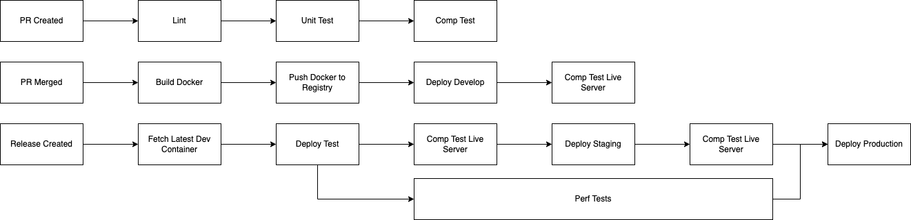

# Hostelworld Tech Challenge

## Overview
This document outlines the key challenges and tasks related to securing applications, infrastructure, and access control in a cloud environment. Below are the specific scenarios and questions to address.

---

## Securing the Release Pipeline

The application is a **Node.js Application** served in a **Docker Container**. The pipeline uses **GitHub Actions** for CI/CD.

### Tasks:
1. **Propose steps to secure the release pipeline.**
   - What tools would you add, why, and where in the pipeline?
   - What would be the outcome of a failure?

---

## Securing Legacy VMs

You have legacy VM(s) running a critical application in GCP that cannot be easily updated.

### Tasks:
1. **Steps to secure the VM(s):**
   - Describe how you would secure these legacy machines.

2. **Incident Response:**
   - An alert has been detected on the legacy VM, indicating unauthorized access and potential data breaches.
   - What steps would you take to contain this breach?

---

## Securing Container Platforms

You are planning to migrate some applications from VMs to containers.

### Tasks:
1. **Best Practices for Securing Containers:**
   - What are the best practices for securing container images?
   - What tools would help achieve this?

2. **Secret Management:**
   - Describe techniques for managing secrets for applications in containers within a cloud environment.

---

## Configuring IAM Roles in GCP

### Scenario 1: Development Team Permissions
- You need to set up a new project in GCP for a development team.
- Team members should be able to create and manage specific resources but not access billing information.

**Task:**  
Describe the steps to configure IAM roles and permissions for this team.

### Scenario 2: Application Access Control
- The team wants to create a new application that requires access to storage buckets and cloud logging.

**Task:**  
Explain the best way to set up roles for this application.

### Scenario 3: Auditing IAM Policies
- You suspect some IAM policies in your cloud environment may not adhere to the principles of least privilege.

**Task:**  
Describe a plan to audit and monitor IAM policies to ensure compliance with least privilege principles.

### Scenario 4: Automating IAM Policy Management
- The organization wants to automate IAM policy management to ensure consistency and compliance using Infrastructure as Code (IaC) tools like Terraform.

**Task:**  
Describe how you would use IaC tools like Terraform to manage, deploy, and maintain these policies.

### Attempted answers
This url point to the attempted annswers to the the Questions above

- [Answers](ANSWERS.md)